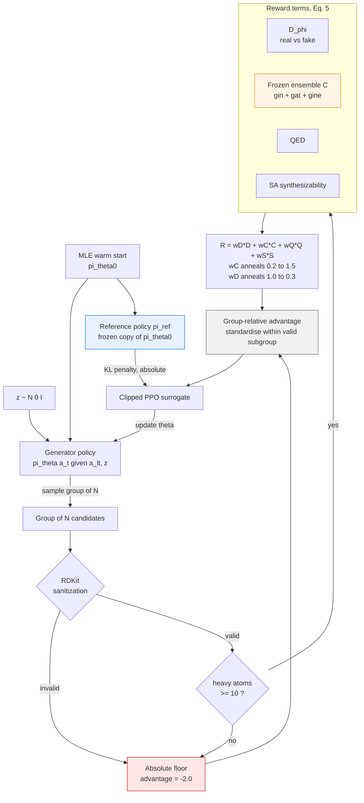
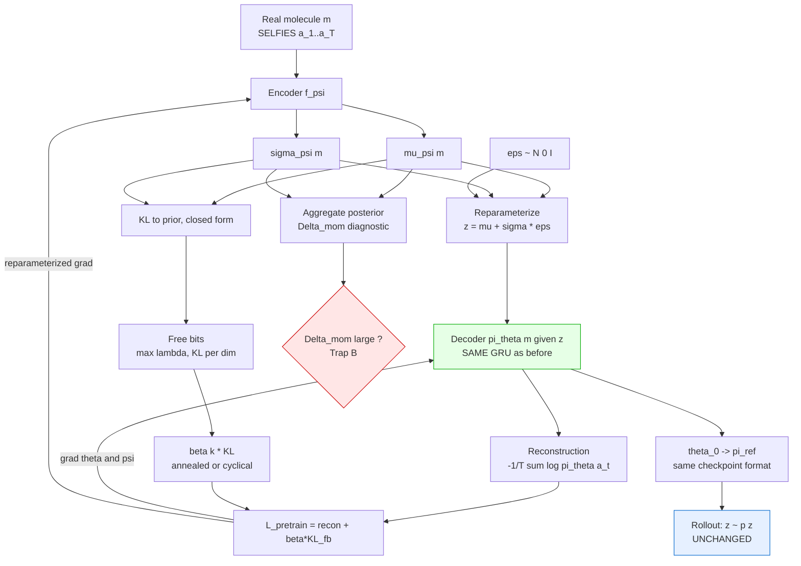
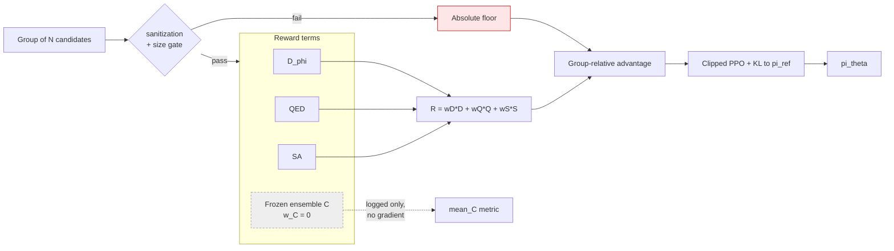
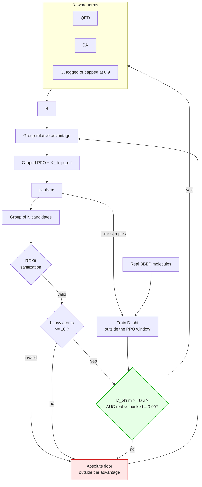

# Architecture diagrams: current, and the three variants under test

Mermaid sources for the architectures being evaluated. The organising idea
across all four is a single distinction, established by measurement:

> `group_advantages` standardises the total reward **within the group**, so it
> is invariant to anything uniform across that group — verified for uniform
> scale, uniform shift, and a uniform multiplicative factor. Any signal that
> says "all of these are unrealistic" is therefore **erased**. Only terms
> evaluated **outside** the advantage survive: the absolute invalidity floor,
> and the KL to `pi_ref`.

That is why the size gate and `kl_coef=0.3` worked while reward reweighting,
the logit transform, the alert penalty and the Tox21 term did not.

---

## 1. Current architecture (baseline, `kl_coef=0.3`, size gate)

Red = outside the advantage (absolute). Blue = the other absolute term.
Orange = the hacked term.

---

## 2. VAE-augmented pretraining (new backbone)

Changes **only** the pretraining stage that produces `theta_0`. Rollout,
reward, advantage and GRPO are untouched: at generation time `z ~ p(z)`
exactly as before.

**Measured verdict: no benefit downstream, and a small validity cost.**

The first read of this ("worse on every seed", downstream scaffold 0.770 vs
0.816 with C) is withdrawn: every GRPO seed in that design shared ONE
pretrained checkpoint per arm, so the thing being compared had n=1 while the
seeds only resampled the rollouts. Warm-start variance is ~2x GRPO-seed
variance here, so that design put the larger variance component inside the
quantity it held fixed.

Re-run with a per-seed warm start (`results/factorial_ws`, VAE minus MLE,
4 seeds, paired on seed and checkpoint):

| metric | w_C on | w_C off | seeds improved |
|---|---|---|---|
| scaffold_frac | -0.052 | -0.001 | 1/4, 1/4 |
| c_mean | +0.000 | -0.001 | 2/4, 2/4 |
| tanimoto_dist | -0.001 | +0.005 | 2/4, 4/4 |
| valid_frac | **-0.014** | **-0.016** | **0/4, 0/4** |

Diversity and permeability are noise — means at or near zero, sign agreement
at chance. The one effect that holds is validity: the VAE decoder is less
valid on every seed in both cells, by about 1.5 points absolute. So the
honest claim is not "the VAE is worse at generating molecules", it is "the
VAE buys nothing downstream and costs a little validity".

Trap A did occur, and that part stands independently of the pairing because
it is measured on the pretraining objective, not on GRPO: true latent
information is 1.07 nats across 64 dims, reconstruction gain 0.048
nats/token, and raising free bits only pins KL at the floor while `Delta_mom`
degrades (1.64 to 2.61 to 5.67). Prior-sample scaffold diversity is also
genuinely lower (0.579 vs 0.730) — the latent is near-collapsed, so sampling
`z ~ p(z)` barely moves the decoder. That explains the downstream null: a
warm start whose latent carries 1 nat is, at generation time, almost the MLE
warm start.

---

## 3. No frozen ensemble (`--drop C`)

C is still **scored and logged**, so permeability stays measurable; it simply
stops steering.

**Measured verdict: better realism.** mean_C 0.878 against real BBB+ at
0.858, versus 0.926 when C steers — the overshoot *is* the hack. TPSA spread
improves 0.394 to 0.462. Permeability survives because QED/SA/D/KL already
select for drug-like structure.

---

## 4. Realism gate on D_phi (proposed)

The merge of frozen ensemble and discriminator that actually works: not a
merged **score** — which group standardisation erases — but a **gate**, which
routes through the absolute floor exactly as the size gate does.

**Rationale.** D scores real BBB+ drugs 0.940 and collapsed output 0.060
(AUC 0.997) — the detector already exists and is near-perfect. It fails today
because `w_D` anneals *down* to 0.3 while within a collapsed group D is
uniformly ~0.06, so its within-group sd is 0.066 and standardisation discards
it. A gate bypasses that entirely.

**Untested, and the risk is real:** D is adversarially trained, so the gate
moves between steps and the generator may learn to satisfy it without
becoming more realistic — the same Goodhart failure as the alert penalty.
Needs a 3-seed arm study with a held-out realism instrument before it is
trusted.
